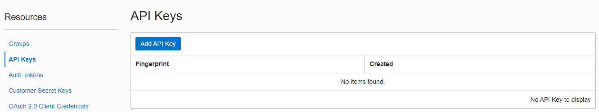
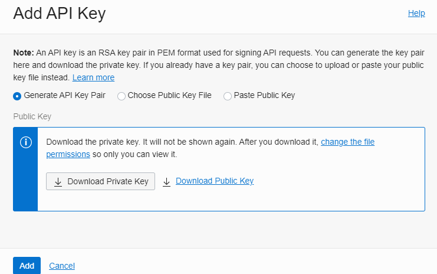
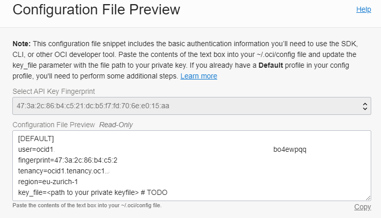

# Installation Guide for OCI Monitoring - EXPERIMENTAL

Note: This is an experimental environment, feel free to try it out, extend it and have fun with it!

Installs a basic OCI monitoring solution with these components based on Ansible in Oracle Linux 8. The setup is tested for

- OL8 running in ESXi
- OL8 running in local VMware Workstation with NAT
- OL8 running in Oracle Cloud Infrastructure

Installed components by Ansible roles:

- Docker
- Steampipe
- Grafana
- Prometheus
- Push Gateway
- PostgreSQL

## Links

- [Steampipe](https://steampipe.io/)
- [Prometheus](https://prometheus.io/)
- [Grafana](https://grafana.com/)
- [OCI CLI](https://docs.oracle.com/en-us/iaas/Content/API/Concepts/cliconcepts.htm)

## How it works


1. Execute Python Script
2. Steampipe gathers the information from Oracle Cloud Infrastructure
3. The return value is pushed to Prometheus Push Gateway
4. Prometheus scrapes the metric from the gateway
5. Grafana reads the metric from Prometheus

## Prerequisites

- root access by password
- /etc/hosts configured
- Ansible and Git configured
- Internet access for download YUM packages and Ansible Galaxy role
- Oracle Cloud Infrastructure user which has inspect permissions (how? see below) and his SSH PEM key and config

### OL8 ESXi / OL8 VMware - Software Installation 

As user root:

```bash
yum -y install yum-utils
yum -y install oracle-epel-release-el8
yum-config-manager --enable ol8_developer_EPEL
yum -y install ansible git
```

### Oracle Cloud Infrastructure - Software Installation OL8

As user opc:

```bash
sudo dnf upgrade
sudo dnf -y install oracle-epel-release-el8
sudo dnf config-manager --enable ol8_developer_EPEL
sudo dnf -y install ansible git
```

## Installation and Configuration

### Login as OS user root into your Oracle Linux 8 server

```bash
# id
uid=0(root) gid=0(root) groups=0(root) context=unconfined_u:unconfined_r:unconfined_t:s0-s0:c0.c1023
```

### Clone the repository to a local folder like /root/git

```bash
# mkdir git
# cd git
# git clone https://github.com/martinberger-ch/oci-monitoring.git
```

### Change to subdirectory oci-monitoring

```bash
# cd oci-monitoring
```

### Oracle Cloud Infrastructure - Adapt Ansible _hosts_ file in directory with your ip and the path to the opc SSH key

- Add path to SSH key and local IP address

```bash
[all:vars]
ansible_ssh_private_key_file=/home/opc/.ssh/<your_ssh_key_file_name_here>

[monitoring]
<your_oci_compute_private_instance_IP_here> ansible_user=opc ansible_python_interpreter="/usr/bin/env python3"
```

- After the installation, it's a good practise to remove opc private key from compute instance again.

### OL8 ESXi / OL8 VMware - Adapt Ansible _hosts_ file in directory with your ip and root password (ansible_ssh_pass) - required for local connections

```bash
[monitoring]
<your_local_IP_here> ansible_user=root ansible_ssh_pass=<your_root_password_here> ansible_python_interpreter="/usr/bin/env python3"
```

### Run _ansible-galaxy collection install -r roles/requirements.yml_

```bash
# ansible-galaxy collection install -r roles/requirements.yml
```

### Run _ansible-playbook install.yml_

```bash
# ansible-playbook install.yml
```

## Verification

As OS user root, verify is all Docker containers are running:

```bash
# docker ps
CONTAINER ID   IMAGE              COMMAND                  CREATED             STATUS             PORTS                    NAMES
f7f2e137f4a1   prom/pushgateway   "/bin/pushgateway"       About an hour ago   Up About an hour   0.0.0.0:9091->9091/tcp   pushgateway
c6ecc72065c9   prom/prometheus    "/bin/prometheus --c…"   About an hour ago   Up About an hour   0.0.0.0:9090->9090/tcp   prometheus
3485de8cc1f9   grafana/grafana    "/run.sh"                About an hour ago   Up About an hour   0.0.0.0:3000->3000/tcp   grafana
8e821aa0044b   turbot/steampipe   "docker-entrypoint.s…"   About an hour ago   Up 30 minutes      0.0.0.0:9193->9193/tcp   steampipe
```

### Network Security

The Ansible playbooks open additionally these ports in the VM for (troubleshooting) access:

- 3000 - Grafana
- 9090 - Prometheus
- 9091 - Prometheus Push Gateway
- 9093 - Steampipe Service

## OCI Configuration

After the successful Ansible execution, put your personal OCI configuration and SSH key into directory /home/steampipe/.oci. Replace the dummy values. Adapt file /home/steampipe/config/oci.spc with the correct SSH key file name.

Take care that owner and group of the OCI configuration file is OS user _steampipe_.

Example:

```bash
# pwd
/home/steampipe/.oci

# ll
total 8
-rw-r--r--. 1 steampipe steampipe  307 Aug  9 09:01 config
-rw-r--r--. 1 steampipe steampipe 1730 Aug  9 09:01 jurasuedfuss-20210809.pem
```

Restart Docker container for Steampipe:

```bash
# docker stop steampipe
# docker start steampipe
```

## Note: How to create the user for OCI access - based on OCI CLI

Here we create an OCI user for monitoring, and existing OCI CLI setup for an tenant administrator is required to execute the steps. The required SSH key in PEM format can be downloaded in OCI web interface. The user, group and policy can be created iun web interface too. All we need for steampipe is the OCI config file for the new user and his SSH key in PEM format.

### Create User

```bash
oci iam user create --name oci_user_readonly --description "OCI User with inspect all-resources." 
```

### Create Group

```bash
oci iam group create --name oci_group_readonly --description "OCI Group with inspect all-resources."
```

### Add User to Group

```bash
oci iam group add-user \
--user-id <your user OCID from created user above> \
--group-id <your group OCID from created group above> \
```

### Create Policy

```bash
oci iam policy create \
--compartment-id <your tenancy OCID> \
--name oci_policy_readonly \
--description "OCI Policy with inspect all-resources." \
--statements '[ "allow group oci_group_readonly to inspect all-resources on tenancy" ]' \
```

### Add API Key



Add API key.



Download the created private key in PEM format.



Copy the configuration file preview, the values are used for Steampipe OCI configuration.

## Steampipe

### OCI Regions

To filter your regions, just edit the file _/home/steampipe/config/oci.spc_ - example:

```bash
connection "oci_tenant_kestenholz" {
  plugin                = "oci"
  config_file_profile   = "DEFAULT"          # Name of the profile
  config_path           = "~/.oci/config"    # Path to config file
  regions               = ["eu-frankfurt-1" , "eu-zurich-1"] # List of regions
}
```

Here are some commands to verify if Steampipe is working properly and the connections works as expected. Execute as OS user root:

```bash
# docker exec -it steampipe steampipe plugin list
+--------------------------------------------+---------+-----------------------+
| Name                                       | Version | Connections           |
+--------------------------------------------+---------+-----------------------+
| hub.steampipe.io/plugins/turbot/oci@latest | 0.1.0   | oci_tenant_kestenholz |
+--------------------------------------------+---------+-----------------------+

```

```bash
# docker exec -it steampipe steampipe query "select display_name,shape,region from oci_core_instance where lifecycle_state='RUNNING';"
+-----------------------------------+------------------------+----------------+
| display_name                      | shape                  | region         |
+-----------------------------------+------------------------+----------------+
| Instance-DB-1                     | VM.Standard1.2         | eu-frankfurt-1 |
| Instance-AS-1                     | VM.Standard1.1         | eu-frankfurt-1 |
+-----------------------------------+------------------------+----------------+
```

```bash
# docker exec -it steampipe steampipe query "select key,title,status from oci_region where is_home_region=true;"
+-----+----------------+--------+
| key | title          | status |
+-----+----------------+--------+
| FRA | eu-frankfurt-1 | READY  |
+-----+----------------+--------+
```

## Python Example Scripts

In subdirectory _/home/steampipe/py_ there are two basic examples how to get the data from Steampipe PostgreSQL service in Python3. Feel free to adapt the queries and files. Returned values are pushed to Prometheus Gateway to port 9091 for further usage.

| Script                                 | Purpose                                              |   |   |   |
|----------------------------------------|------------------------------------------------------|---|---|---|
| pgsql-query-bv-zurich.py               | Summary of Block Volume in OCI Region Zurich         |   |   |   |
| pgsql-query-ci-running-zurich.py       | Summary of running Instances in OCI Region Zurich    |   |   |   |

Attention: Actually you have to restart the Docker container before executing Python3 according this error - I am investigating on it.

Manual execution and upload of the query result:

```bash
# python3 pgsql-query-ci-running-zurich.py
# python3 pgsql-query-bv-zurich.py
```

```bash
Something went wrong: no connection config loaded for connection 'oci'
```

Restarting Steampipe as OS user root:

```bash
# docker stop steampipe
# docker start steampipe

```

## Prometheus Push Gateway

According the Python script, new data is loaded in Prometheus Push Gateway to port 9091 and scraped by Prometheus port 9090. Example for Protheus Gateway where data is loaded by jobs _oci_blockvolume_ / _oci_compute_.


## Grafana

Grafana is reachable by address _your-machine-ip:3000_.

- Username: admin
- Password: welcome1

The Prometheus data source and a basic dashboard are deployed during the Grafana Docker setup process. Example for dasboard _OCI Demo - eu-zurich-1_:

Prometheus data source:


Sample dashboard OCI Demo:


Here you can see the pushed metric from the Python script by name:


## Troubleshooting

### Docker Logs

To verify if Steampipe is running properly:

```bash
# docker logs steampipe
```

### Steampipe Access Logs

The foreign data wrapper logs are stored locally - not in the Docker container - in the directory _/home/steampipe/logs_:

```bash
drwx------. 11 steampipe steampipe     173 Aug  9 17:18 ..
-rw-------.  1      9193 root       756701 Aug  9 19:57 database-2021-08-09.log
drwxrwxr-x.  2 steampipe root           68 Aug 10 02:00 .
-rw-------.  1      9193 root      3411203 Aug 10 07:19 database-2021-08-10.log
```