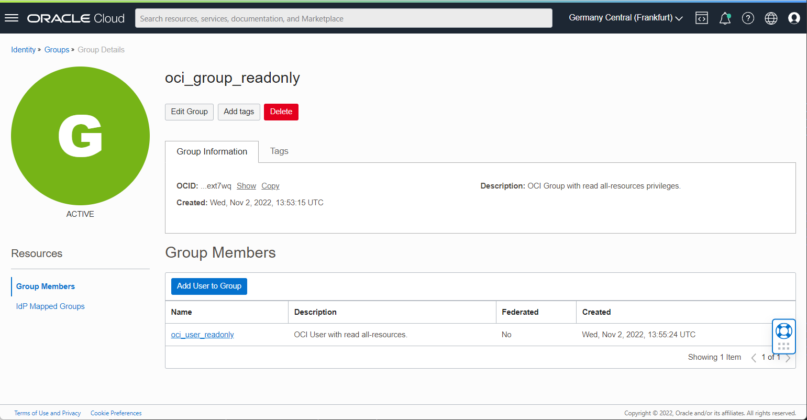
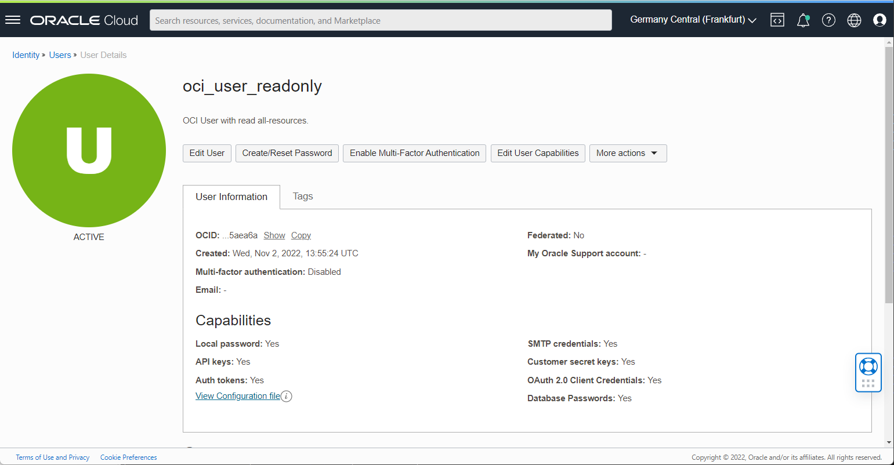
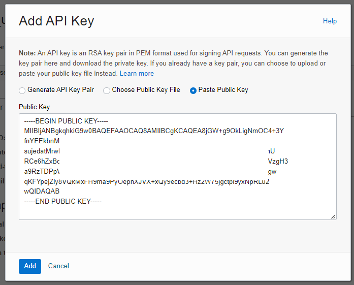

# Installation Guide for OCI Monitoring with Steampipe.io

This guide shows you how to install and setup a nice monitoring solution based on Steampipe.io, Docker and Co. Steampipe.io
is a framework, where you can query Oracle Cloud Infrastructure resources by SQL language.

This guide is tested in OL8 running on Oracle Cloud Infrastructure.

## How it works


1. Execute Python Script
2. Steampipe gathers the information from Oracle Cloud Infrastructure
3. The return value is pushed to Prometheus Push Gateway
4. Prometheus scrapes the metric from the gateway
5. Grafana reads the metric from Prometheus

## Installed components by Ansible roles

- Docker
- Steampipe
- Grafana
- Prometheus
- Push Gateway
- PostgreSQL

The Docker containers are started by docker-compose.

## Links

- [Steampipe](https://steampipe.io/)
- [Prometheus](https://prometheus.io/)
- [Grafana](https://grafana.com/)
- [OCI CLI](https://docs.oracle.com/en-us/iaas/Content/API/Concepts/cliconcepts.htm)

## Compute Node Requirements

- VCN with internet access by Internet Gateway or NAT Gateway
- OL 8 Compute Instance up and running
- SSH keys user _opc_ related
- OS access as user _opc_


## Prerequisites

- opc SSH private key available on playbook execution host
- /etc/hosts configured
- Ansible and Git configured
- Internet access for download YUM packages and Ansible Galaxy role
- OCI CLI configured with instance principal as user _oci_.
- SELinux set to permissive
- An OCI User and Group with _inspect all-resources_ and _request.operation='GetConfiguration'_ privileges.

### Oracle Cloud Infrastructure - Create the user for OCI API access - based on OCI CLI

First we need an OCI group, user and policy for monitoring. If you have admin privileges and an
already configured OCI CLI, you can do it by CLI commands.

- OCID of created user
- OCID of the tenancy

User, group and policy can be created in web interface too.

#### Create Group



```bash
oci iam group create --name oci_group_readonly --description "OCI Group with inspect all-resources privileges."
```

#### Create IAM User



```bash
oci iam user create --name oci_user_readonly --description "OCI User with inspect all-resources." 
```

#### Add User to Group


```bash
oci iam group add-user \
--user-id <your user OCID from created user above> \
--group-id <your group OCID from created group above>
```

#### Create Policy

According Steampipe.io: <https://hub.steampipe.io/plugins/turbot/oci>


```bash
oci iam policy create \
--compartment-id <your root compartment OCID> \
--name oci_policy_readonly \
--description "OCI Policy with inspect all-resources." \
--statements '[ "allow group oci_group_readonly to inspect all-resources on tenancy","allow group oci_group_readonly to manage all-resources in tenancy where request.operation='GetConfiguration'" ]' \
```

#### Gather Tenancy OCID Information

The tenancy OCID will be used later for the OCI CLI configuration.

Menu -> Governance & Administration -> Tenancy Details.


### Required YUM Packages

As user opc:

```bash
sudo dnf -y install ansible git
```

## Installation and Configuration

### Login and change user to root.

User _opc_ has sudo permissions.

```bash
sudo su -
```

### Clone the repository to a local folder 

```bash
mkdir git
cd git
git clone https://github.com/martinberger-ch/oci-monitoring.git
```

### Change to subdirectory oci-monitoring

```bash
cd oci-monitoring
```

### Run _ansible-galaxy collection install -r roles/requirements.yml_

Installs the community docker module for Ansible. User is _root_.

```bash
# ansible-galaxy collection install -r roles/requirements.yml
```

### Run _ansible-playbook install.yml_

Creates users and directories, installs required software and configures Docker containers.

```bash
# ansible-playbook install.yml
```

## Verification

As OS user root, verify is all Docker containers are running:

```bash
# docker ps
CONTAINER ID   IMAGE              COMMAND                  CREATED             STATUS             PORTS                    NAMES
f7f2e137f4a1   prom/pushgateway   "/bin/pushgateway"       About an hour ago   Up About an hour   0.0.0.0:9091->9091/tcp   pushgateway
c6ecc72065c9   prom/prometheus    "/bin/prometheus --c…"   About an hour ago   Up About an hour   0.0.0.0:9090->9090/tcp   prometheus
3485de8cc1f9   grafana/grafana    "/run.sh"                About an hour ago   Up About an hour   0.0.0.0:3000->3000/tcp   grafana
8e821aa0044b   turbot/steampipe   "docker-entrypoint.s…"   About an hour ago   Up 30 minutes      0.0.0.0:9193->9193/tcp   steampipe
```

### Network Security

The Ansible playbooks opens additionally these ports in the VM for (troubleshooting) access. Take care: you need
to open these ports in the OCI VCN Security List too to get web access.

- 3000 - Grafana
- 9090 - Prometheus
- 9091 - Prometheus Push Gateway
- 9093 - Steampipe Service

### Oracle Cloud Infrastructure - with SSH key for OS user opc

Copy the instance SSH key to .ssh directory of the user opc where you run ansible. Remove the private SSH key after the installation as it is a risk to have the private on the cloud instance. But in our case it is required for the setup by Ansible.

Important: You have to use the private IP address in the configuration file.

```bash
[all:vars]
ansible_ssh_private_key_file=/home/opc/.ssh/ssh-key-2021-09-22.key

[monitoring]
<your_private_IP_here> ansible_user=opc ansible_python_interpreter="/usr/bin/env python3"
```
## Steampipe

As OS user _steampipe_, install the OCI CLI. Answer all questions with _enter_.

## OCI CLI

```bash
sudo su - steampipe
bash -c "$(curl -L https://raw.githubusercontent.com/oracle/oci-cli/master/scripts/install/install.sh)"
```

Execute the setup with your user and tenant OCID, create a new API Signing Key Pair.This key is later used. Use

- OCID of created user
- OCID of the tenancy

from the user creation process. Example for region _zurich_.

```bash
oci setup config

/home/steampipe/lib/oracle-cli/lib64/python3.6/site-packages/oci/_vendor/httpsig_cffi/sign.py:10: CryptographyDeprecationWarning: Python 3.6 is no longer supported by the Python core team. Therefore, support for it is deprecated in cryptography and will be removed in a future release.
  from cryptography.hazmat.backends import default_backend  # noqa: F401
    This command provides a walkthrough of creating a valid CLI config file.

    The following links explain where to find the information required by this
    script:

    User API Signing Key, OCID and Tenancy OCID:

        https://docs.cloud.oracle.com/Content/API/Concepts/apisigningkey.htm#Other

    Region:

        https://docs.cloud.oracle.com/Content/General/Concepts/regions.htm

    General config documentation:

        https://docs.cloud.oracle.com/Content/API/Concepts/sdkconfig.htm


Enter a location for your config [/home/steampipe/.oci/config]:
Enter a user OCID: ocid1.user.oc1..aaaaaaaalot4gawqm2sx54cwedzsxslehkb4k4umszksk7qogci1234567
Enter a tenancy OCID: ocid1.tenancy.oc1..aaaaaaaaagcamhpk2tn6josi7qqt6fzlnrvytfa3tv3cszkmkfz1234567
Enter a region by index or name(e.g.
1: af-johannesburg-1, 2: ap-chiyoda-1, 3: ap-chuncheon-1, 4: ap-dcc-canberra-1, 5: ap-hyderabad-1,
6: ap-ibaraki-1, 7: ap-melbourne-1, 8: ap-mumbai-1, 9: ap-osaka-1, 10: ap-seoul-1,
11: ap-singapore-1, 12: ap-sydney-1, 13: ap-tokyo-1, 14: ca-montreal-1, 15: ca-toronto-1,
16: eu-amsterdam-1, 17: eu-dcc-milan-1, 18: eu-frankfurt-1, 19: eu-madrid-1, 20: eu-marseille-1,
21: eu-milan-1, 22: eu-paris-1, 23: eu-stockholm-1, 24: eu-zurich-1, 25: il-jerusalem-1,
26: me-abudhabi-1, 27: me-dcc-muscat-1, 28: me-dubai-1, 29: me-jeddah-1, 30: mx-queretaro-1,
31: sa-santiago-1, 32: sa-saopaulo-1, 33: sa-vinhedo-1, 34: uk-cardiff-1, 35: uk-gov-cardiff-1,
36: uk-gov-london-1, 37: uk-london-1, 38: us-ashburn-1, 39: us-gov-ashburn-1, 40: us-gov-chicago-1,
41: us-gov-phoenix-1, 42: us-langley-1, 43: us-luke-1, 44: us-phoenix-1, 45: us-sanjose-1): 24
Do you want to generate a new API Signing RSA key pair? (If you decline you will be asked to supply the path to an existing key.) [Y/n]:
Enter a directory for your keys to be created [/home/steampipe/.oci]:
Enter a name for your key [oci_api_key]:
Public key written to: /home/steampipe/.oci/oci_api_key_public.pem
Enter a passphrase for your private key (empty for no passphrase):
Private key written to: /home/steampipe/.oci/oci_api_key.pem
Fingerprint: c9:ce:39:fa:20:5f:6f:4b:a2:6b:a5:f3:cf:0e:90:fe
Config written to /home/steampipe/.oci/config


    If you haven't already uploaded your API Signing public key through the
    console, follow the instructions on the page linked below in the section
    'How to upload the public key':

        https://docs.cloud.oracle.com/Content/API/Concepts/apisigningkey.htm#How2


```

### Add API Key

Copy the content of the public key file created by OCI CLI and add it to the user's API
configuration.

```bash
cat /home/steampipe/.oci/oci_api_key_public.pem
```



Verify the functionality of the OCI CLI - get Object Storage namespace name:

```bash
oci os ns get
{
  "data": "<your-namespace-here>"
}
```

### File /home/steampipe/config/oci.spc - Steampipe Region Filter

To filter your regions, just edit the file _/home/steampipe/config/oci.spc_ - example:

```bash
connection "oci_tenant_kestenholz" {
  plugin                = "oci"
  config_file_profile   = "DEFAULT"          # Name of the profile
  config_path           = "~/.oci/config"    # Path to config file
  regions               = ["eu-zurich-1"]    # List of regions
}
```

Restart Docker container for Steampipe as OS user root:

```bash
sudo su -
# docker stop steampipe
# docker start steampipe
```

### Steampipe Verification

Here are some commands to verify if Steampipe is working properly and the connections works as expected. Execute as OS user root:

```bash
# docker exec -it steampipe steampipe plugin list
[root@ci-monitoring ~]# docker exec -it steampipe steampipe plugin list
+--------------------------------------------+---------+-----------------------+
| Name                                       | Version | Connections           |
+--------------------------------------------+---------+-----------------------+
| hub.steampipe.io/plugins/turbot/oci@latest | 0.17.1  | oci_tenant_kestenholz |
+--------------------------------------------+---------+-----------------------+
```

Note: If the _Connections_ columns is empty, restart as user root the steampipe container again:

```bash
# docker stop steampipe
# docker start steampipe
```

```bash
# docker exec -it steampipe steampipe query "select display_name,shape,region from oci_core_instance where lifecycle_state='RUNNING';"
+-----------------------------------+------------------------+----------------+
| display_name                      | shape                  | region         |
+-----------------------------------+------------------------+----------------+
| Instance-DB-1                     | VM.Standard1.2         | eu-frankfurt-1 |
| Instance-AS-1                     | VM.Standard1.1         | eu-frankfurt-1 |
+-----------------------------------+------------------------+----------------+
```

```bash
# docker exec -it steampipe steampipe query "select key,title,status from oci_region where is_home_region=true;"
+-----+----------------+--------+
| key | title          | status |
+-----+----------------+--------+
| FRA | eu-frankfurt-1 | READY  |
+-----+----------------+--------+
```

## Python Example Scripts

In subdirectory of new add OS user steampipe _/home/steampipe/py_ there are two basic examples how to get the data from Steampipe PostgreSQL service in Python3. Feel free to adapt the queries and files. Returned values are pushed to Prometheus Gateway to port 9091 for further usage.

| Script                                 | Purpose                                              |   |   |   |
|----------------------------------------|------------------------------------------------------|---|---|---|
| pgsql-query-bv-zurich.py               | Summary of Block Volume in OCI Region Zurich         |   |   |   |
| pgsql-query-ci-running-zurich.py       | Summary of running Instances in OCI Region Zurich    |   |   |   |

Attention: Actually you have to restart the Docker container before executing Python3 according this error - I am investigating on it.

Manual execution and upload of the query result:

```bash
# python3 pgsql-query-ci-running-zurich.py
# python3 pgsql-query-bv-zurich.py
```

## Prometheus Push Gateway

According the Python script, new data is loaded in Prometheus Push Gateway to port 9091 and scraped by Prometheus port 9090. Example for Protheus Gateway where data is loaded by jobs _oci_blockvolume_/_oci_compute_.


## Grafana

Grafana is reachable by address _your-machine-ip:3000_.

- Username: admin
- Password: Welcome1

The Prometheus data source and a basic dashboard are deployed during the Grafana Docker setup process. Example for dashboard _OCI Demo - eu-zurich-1_:

Prometheus data source:


Sample dashboard OCI Demo:


Here you can see the pushed metric from the Python script by name:


## Troubleshooting

### Docker Logs

To verify if Steampipe is running properly:

```bash
# docker logs steampipe
```

### Steampipe Access Logs

The foreign data wrapper logs are stored locally - not in the Docker container - in the directory _/home/steampipe/logs_:

```bash
drwx------. 11 steampipe steampipe     173 Aug  9 17:18 ..
-rw-------.  1      9193 root       756701 Aug  9 19:57 database-2021-08-09.log
drwxrwxr-x.  2 steampipe root           68 Aug 10 02:00 .
-rw-------.  1      9193 root      3411203 Aug 10 07:19 database-2021-08-10.log
```

### Steampipe Restart

```bash
Something went wrong: no connection config loaded for connection 'oci'
```

Restarting Steampipe as OS user root:

```bash
# docker stop steampipe
# docker start steampipe
```

### Grafana Panel Installation

```bash
TASK [config : include_tasks] ******************************************************************************************************************************************************************
fatal: [192.168.201.57]: FAILED! => {"reason": "couldn't resolve module/action 'community.docker.docker_container_exec'. This often indicates a misspelling, missing collection, or incorrect module path.\n\nThe error appears to be in '/root/git/oci-monitoring/roles/config/tasks/config-grafana.yml': line 4, column 3, but may\nbe elsewhere in the file depending on the exact syntax problem.\n\nThe offending line appears to be:\n\n\n- name: Install Grafana time and date panel\n  ^ here\n"}
```

Restart installation.
