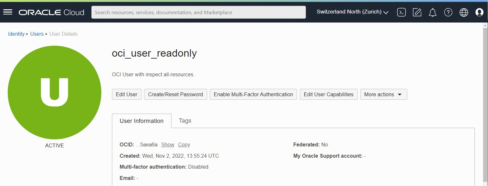
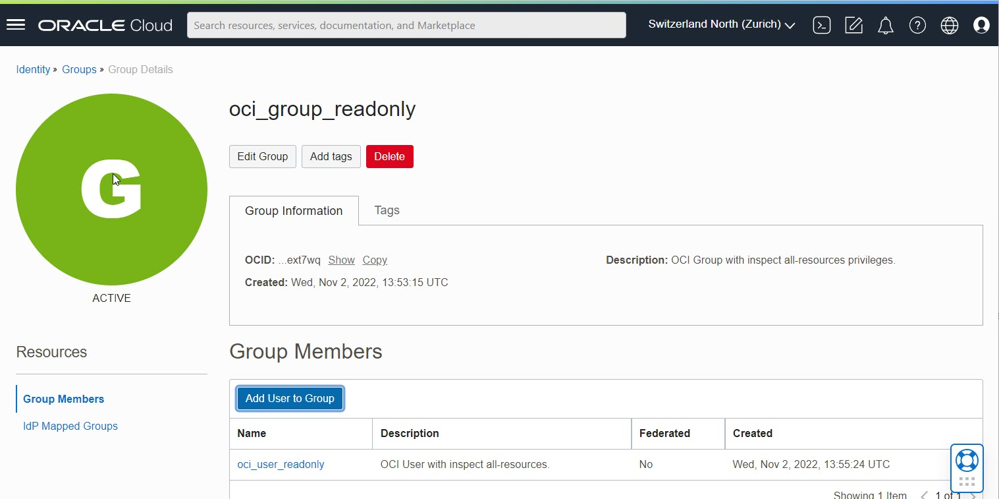
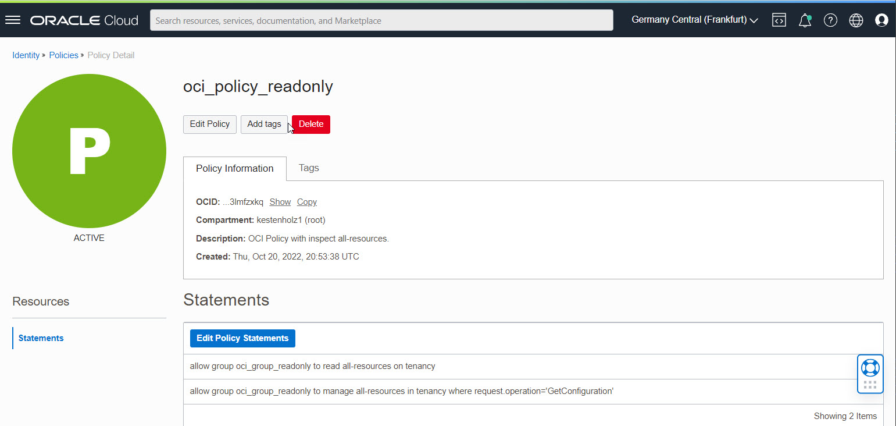

# Installation Guide for OCI Monitoring with Steampipe.io

This guide shows you how to install and setup a nice monitoring solution based on Steampipe.io, Docker and Co. Steampipe.io
is a framework, where you can query Oracle Cloud Infrastructure resources by SQL language.

This guide is tested in OL 8 running on Oracle Cloud Infrastructure.

## How it works


1. Execute Python Script
2. Steampipe gathers the information from Oracle Cloud Infrastructure
3. The return value is pushed to Prometheus Push Gateway
4. Prometheus scrapes the metric from the gateway
5. Grafana reads the metric from Prometheus

## Installed components by Ansible roles

- Docker
- Steampipe
- Grafana
- Prometheus
- Push Gateway
- PostgreSQL

The Docker containers are started by docker-compose.

## New OS User added

During the Ansible playbook execution, a new OS user called_steampipe_ is created. This user is used for the OCI CLI and Steampipe.io configuration.

## Links

- [Steampipe](https://steampipe.io/)
- [Prometheus](https://prometheus.io/)
- [Grafana](https://grafana.com/)
- [OCI CLI](https://docs.oracle.com/en-us/iaas/Content/API/Concepts/cliconcepts.htm)

## Compute Node Setup

- VCN with internet access by Internet Gateway or NAT Gateway
- OL 8 Compute Instance up and running
- SSH keys user _opc_ related
- OS access as user _opc_ and SSH private key available for Ansible playbook execution
- /etc/hosts configured
- Ansible and Git configured
- SELinux set to PERMISSIVE in /etc/selinux/config

  


## Oracle Cloud Infrastructure IAM Requirements

- An OCI User and Group with _inspect all-resources_ and _request.operation='GetConfiguration'_ privileges - see section below.

## Oracle Cloud Infrastructure - Create the user for OCI API access - based on OCI CLI

First we need an OCI group, user and policy for monitoring. If you have admin privileges and an
already configured OCI CLI, you can do it by CLI commands.

- OCID of created user
- OCID of the tenancy

User, group and policy can be created in web interface too.

### Create Group


```bash
oci iam group create --name oci_group_readonly --description "OCI Group with inspect all-resources privileges."
```

### Create IAM User



```bash
oci iam user create --name oci_user_readonly --description "OCI User with inspect all-resources." 
```

### Add User to Group



```bash
oci iam group add-user \
--user-id <your user OCID from created user above> \
--group-id <your group OCID from created group above>
```

### Create Policy

According Steampipe.io: <https://hub.steampipe.io/plugins/turbot/oci>



```bash
oci iam policy create \
--compartment-id <your root compartment OCID> \
--name oci_policy_readonly \
--description "OCI Policy with inspect all-resources." \
--statements '[ "allow group oci_group_readonly to inspect all-resources on tenancy","allow group oci_group_readonly to manage all-resources in tenancy where request.operation='GetConfiguration'" ]' \
```

### Gather Tenancy OCID Information

The tenancy OCID will be used later for the OCI CLI configuration.

Menu -> Governance & Administration -> Tenancy Details.


## OS Packages

Login as OS user _opc_ and change to _root_.

```bash
sudo su -
```

### Update the OS and install YUM Packages for Ansible and Git as _root_

```bash
dnf upgrade
dnf install -y ansible git
```

## Monitoring Installation and Configuration

### Clone the GitHub repository to a local folder

As user _opc_, clone the repository.

```bash
mkdir git
cd git
git clone https://github.com/martinberger-ch/oci-monitoring.git
```

### Change to subdirectory oci-monitoring

```bash
cd oci-monitoring
```


### Set private IP for installation process and configure hosts file

Edit hosts file in oci-monitoring subdirectory and change private IP. We use a local connection. Get OCI 
Compute Instance private IP address from instance metadata:

```bash
curl --silent http://169.254.169.254/opc/v1/vnics/ | grep private | awk -F\" '{print $4}'
10.0.0.47
```

```bash
# Set host private IP - example 10.0.0.228
[monitoring]
10.0.0.47 ansible_user=opc ansible_connection=local
```

### Run _ansible-galaxy collection install -r roles/requirements.yml_

Installs the community docker module for Ansible. User is _opc_.

```bash
# ansible-galaxy collection install -r roles/requirements.yml
```

### Run _ansible-playbook install.yml_

Creates users and directories, installs required software and configures Docker containers. User is _opc_.

```bash
# ansible-playbook install.yml
```

## Verification

Verify is all Docker containers are running:

```bash
$ sudo docker ps
CONTAINER ID   IMAGE              COMMAND                  CREATED             STATUS             PORTS                    NAMES
f7f2e137f4a1   prom/pushgateway   "/bin/pushgateway"       About an hour ago   Up About an hour   0.0.0.0:9091->9091/tcp   pushgateway
c6ecc72065c9   prom/prometheus    "/bin/prometheus --c…"   About an hour ago   Up About an hour   0.0.0.0:9090->9090/tcp   prometheus
3485de8cc1f9   grafana/grafana    "/run.sh"                About an hour ago   Up About an hour   0.0.0.0:3000->3000/tcp   grafana
8e821aa0044b   turbot/steampipe   "docker-entrypoint.s…"   About an hour ago   Up 30 minutes      0.0.0.0:9193->9193/tcp   steampipe
```

### Network Security

The Ansible playbooks opens additionally these ports in the VM for (troubleshooting) access. Take care: you need
to open these ports in the OCI VCN Security List too to get web access.

- 3000 - Grafana
- 9090 - Prometheus
- 9091 - Prometheus Push Gateway
- 9093 - Steampipe Service

### Reachability Verification

Verify if Grafana is reachable by your workstation - IP: <http://your-custom-image-ip:3000>


## OCI CLI

As OS user _steampipe_, install the OCI CLI. Answer all questions with _enter_.

### Install OCI CLI

Install and configure the OCI CLI as OS user _opc_.

```bash
sudo su - steampipe
bash -c "$(curl -L https://raw.githubusercontent.com/oracle/oci-cli/master/scripts/install/install.sh)"
```

```bash
 oci --latest-version
```

### Configure OCI CLI

Execute the setup with your user and tenant OCID, create a new API Signing Key Pair. This key is later used in OCI web interface.

Use these parameters:

- OCID of created user _oci_user_readonly_
- OCID of the tenancy
- Your preferred region - e.g.  _eu-zurich-1_.
- Config location: /home/steampipe/.oci/config

If there is already an existing profile, overwrite the file. A new config file and profile is created. In this case, a password for the SSH key is used.
Let the setup tool write it into the OCI config file.

```bash
$ oci setup config
    This command provides a walkthrough of creating a valid CLI config file.

    The following links explain where to find the information required by this
    script:

    User API Signing Key, OCID and Tenancy OCID:

        https://docs.cloud.oracle.com/Content/API/Concepts/apisigningkey.htm#Other

    Region:

        https://docs.cloud.oracle.com/Content/General/Concepts/regions.htm

    General config documentation:

        https://docs.cloud.oracle.com/Content/API/Concepts/sdkconfig.htm


Enter a location for your config [/home/steampipe/.oci/config]:
Enter a user OCID: ocid1.user.oc1..aaaaaaaawg5x5p5p57e3c2vnnmwhqn7bpjnumuwiuseaojw55u6ccl5aea6a
Enter a tenancy OCID: ocid1.tenancy.oc1..aaaaaaaaagcamhpk2tn6josi7qqt6fzlnrvytfa3tv3cszkmkfzfsczlnnsa
Enter a region by index or name(e.g.
1: af-johannesburg-1, 2: ap-chiyoda-1, 3: ap-chuncheon-1, 4: ap-dcc-canberra-1, 5: ap-hyderabad-1,
6: ap-ibaraki-1, 7: ap-melbourne-1, 8: ap-mumbai-1, 9: ap-osaka-1, 10: ap-seoul-1,
11: ap-singapore-1, 12: ap-sydney-1, 13: ap-tokyo-1, 14: ca-montreal-1, 15: ca-toronto-1,
16: eu-amsterdam-1, 17: eu-dcc-milan-1, 18: eu-frankfurt-1, 19: eu-madrid-1, 20: eu-marseille-1,
21: eu-milan-1, 22: eu-paris-1, 23: eu-stockholm-1, 24: eu-zurich-1, 25: il-jerusalem-1,
26: me-abudhabi-1, 27: me-dcc-muscat-1, 28: me-dubai-1, 29: me-jeddah-1, 30: mx-queretaro-1,
31: sa-santiago-1, 32: sa-saopaulo-1, 33: sa-vinhedo-1, 34: uk-cardiff-1, 35: uk-gov-cardiff-1,
36: uk-gov-london-1, 37: uk-london-1, 38: us-ashburn-1, 39: us-gov-ashburn-1, 40: us-gov-chicago-1,
41: us-gov-phoenix-1, 42: us-langley-1, 43: us-luke-1, 44: us-phoenix-1, 45: us-sanjose-1): 24
Do you want to generate a new API Signing RSA key pair? (If you decline you will be asked to supply the path to an existing key.) [Y/n]: Y
Enter a directory for your keys to be created [/home/steampipe/.oci]:
Enter a name for your key [oci_api_key]:
Public key written to: /home/steampipe/.oci/oci_api_key_public.pem
Enter a passphrase for your private key (empty for no passphrase):
Repeat for confirmation:
Private key written to: /home/steampipe/.oci/oci_api_key.pem
Fingerprint: b8:1c:03:c9:80:e7:b0:24:38:80:ce:2e:d9:07:6b:48
Do you want to write your passphrase to the config file? (If not, you will need to enter it when prompted each time you run an oci command) [y/N]: y
Config written to /home/steampipe/.oci/config


    If you haven't already uploaded your API Signing public key through the
    console, follow the instructions on the page linked below in the section
    'How to upload the public key':

        https://docs.cloud.oracle.com/Content/API/Concepts/apisigningkey.htm#How2

```

### Add API Key

Copy the content of the public key file created by OCI CLI and add it to the user's API
configuration.

```bash
cat /home/steampipe/.oci/oci_api_key_public.pem
```


Verify the functionality of the OCI CLI - get Oracle Cloud Infrastructure Object Storage namespace name:

```bash
oci os ns get
{
  "data": "<your-namespace-here>"
}
```

### File /home/steampipe/config/oci.spc - Steampipe Region Filter

The configuration is provided by Ansible automation. You can rename the connection and filter for your regions. Just edit the file _/home/steampipe/config/oci.spc_ - example:

```bash
connection "oci_tenant_kestenholz" {
  plugin                = "oci"
  config_file_profile   = "DEFAULT"          # Name of the profile
  config_path           = "~/.oci/config"    # Path to config file
  regions               = ["eu-zurich-1"]    # List of regions
}
```

Restart Docker container for Steampipe.io as OS user root to enable the settings:

```bash
sudo su -
# docker stop steampipe
# docker start steampipe
```

### Steampipe Verification

Verify if Steampipe.io is working properly and the connection works as expected. Execute as OS user _root_:

```bash
# docker exec -it steampipe steampipe plugin list

+--------------------------------------------+---------+-------------+
| Name                                       | Version | Connections |
+--------------------------------------------+---------+-------------+
| hub.steampipe.io/plugins/turbot/oci@latest | 0.17.1  | oci         |
+--------------------------------------------+---------+-------------+

```

Note: If the _Connections_ columns is empty, restart as user root the steampipe container again and wait a couple of
seconds before re-execute the statement.

```bash
# docker stop steampipe
# docker start steampipe
```

Verify the services are is up and running.

```bash
# docker exec -it steampipe steampipe service status
Steampipe service is running:

Database:

  Host(s):            localhost, 127.0.0.1, 172.18.0.2
  Port:               9193
  Database:           steampipe
  User:               steampipe
  Password:           ********* [use --show-password to reveal]
  Connection string:  postgres://steampipe@localhost:9193/steampipe

Managing the Steampipe service:

  # Get status of the service
  steampipe service status

  # View database password for connecting from another machine
  steampipe service status --show-password

  # Restart the service
  steampipe service restart

  # Stop the service
  steampipe service stop
```

Query for any running Compute Instances in your defined region.

```bash
# docker exec -it steampipe steampipe query "select display_name,shape,region from oci_core_instance where lifecycle_state='RUNNING';"
+-----------------------------------+------------------------+----------------+
| display_name                      | shape                  | region         |
+-----------------------------------+------------------------+----------------+
| Instance-DB-1                     | VM.Standard1.2         | eu-frankfurt-1 |
| Instance-AS-1                     | VM.Standard1.1         | eu-frankfurt-1 |
+-----------------------------------+------------------------+----------------+
```

```bash
# docker exec -it steampipe steampipe query "select key,title,status from oci_region where is_home_region=true;"
+-----+----------------+--------+
| key | title          | status |
+-----+----------------+--------+
| FRA | eu-frankfurt-1 | READY  |
+-----+----------------+--------+
```

## Python Example Scripts

In subdirectory of new add OS user steampipe _/home/steampipe/py_ there are two basic examples how to get the data from Steampipe PostgreSQL service in Python3. Feel free to adapt the queries and files. Returned values are pushed to Prometheus Gateway to port 9091 for further usage.

| Script                                 | Purpose                                              |   |   |   |
|----------------------------------------|------------------------------------------------------|---|---|---|
| pgsql-query-bv-zurich.py               | Summary of Block Volume in OCI Region Zurich         |   |   |   |
| pgsql-query-ci-running-zurich.py       | Summary of running Instances in OCI Region Zurich    |   |   |   |

Attention: Actually you have to restart the Docker container before executing Python3 according this error - I am investigating on it.

Manual execution and upload of the query result:

```bash
# python3 pgsql-query-ci-running-zurich.py
# python3 pgsql-query-bv-zurich.py
```

## Prometheus Push Gateway

According the Python script, new data is loaded in Prometheus Push Gateway to port 9091 and scraped by Prometheus port 9090. Example for Protheus Gateway where data is loaded by jobs _oci_blockvolume_/_oci_compute_.


## Grafana

Grafana is reachable by address _your-machine-ip:3000_.

- Username: admin
- Password: Welcome1

The Prometheus data source and a basic dashboard are deployed during the Grafana Docker setup process. Example for dashboard _OCI Demo - eu-zurich-1_:

Prometheus data source:


Sample dashboard OCI Demo:


Here you can see the pushed metric from the Python script by name:


## Troubleshooting

### Docker Logs

To verify if Steampipe is running properly:

```bash
# docker logs steampipe
```

### Steampipe Access Logs

The foreign data wrapper logs are stored locally - not in the Docker container - in the directory _/home/steampipe/logs_:

```bash
drwx------. 11 steampipe steampipe     173 Aug  9 17:18 ..
-rw-------.  1      9193 root       756701 Aug  9 19:57 database-2021-08-09.log
drwxrwxr-x.  2 steampipe root           68 Aug 10 02:00 .
-rw-------.  1      9193 root      3411203 Aug 10 07:19 database-2021-08-10.log
```

### Steampipe Restart

```bash
Something went wrong: no connection config loaded for connection 'oci'
```

Restarting Steampipe as OS user root:

```bash
# docker stop steampipe
# docker start steampipe
```

### Grafana Panel Installation

```bash
TASK [config : include_tasks] ******************************************************************************************************************************************************************
fatal: [192.168.201.57]: FAILED! => {"reason": "couldn't resolve module/action 'community.docker.docker_container_exec'. This often indicates a misspelling, missing collection, or incorrect module path.\n\nThe error appears to be in '/root/git/oci-monitoring/roles/config/tasks/config-grafana.yml': line 4, column 3, but may\nbe elsewhere in the file depending on the exact syntax problem.\n\nThe offending line appears to be:\n\n\n- name: Install Grafana time and date panel\n  ^ here\n"}
```

Restart installation.

## Notes

oci monitoring metric-data summarize-metrics-data -c ocid1.tenancy.xxxxxxxxxx --namespace xxxxxxxxxxx --query-text 'BytesToIgw[1440m].sum()'
